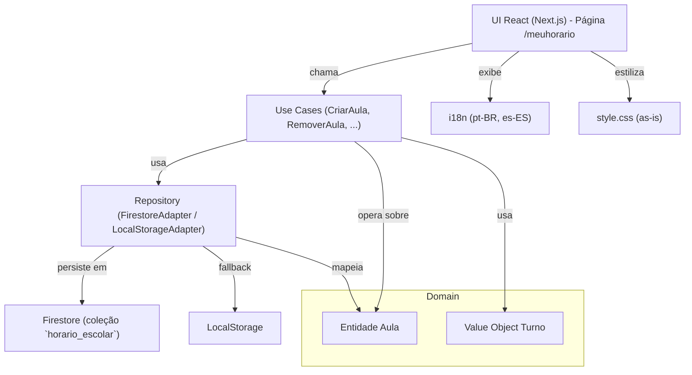

# 🏗️ Arquitetura – Módulo Horário Escolar

## Camadas
- **Apresentação** – componentes React em `src/apresentacao/*` e página Next.js.
- **Aplicação** – casos de uso em `src/aplicacao/use-cases/*`.
- **Domínio** – entidades e objetos de valor em `src/dominio/*`.
- **Infraestrutura** – adaptadores de persistência em `src/infraestrutura/storage/*`.

## Dependências externas
- `firebase` (Firestore)
- `uuid` (geração de IDs)
- `date-fns` (manipulação de horário)
- `i18next` / `react-i18next`

---
